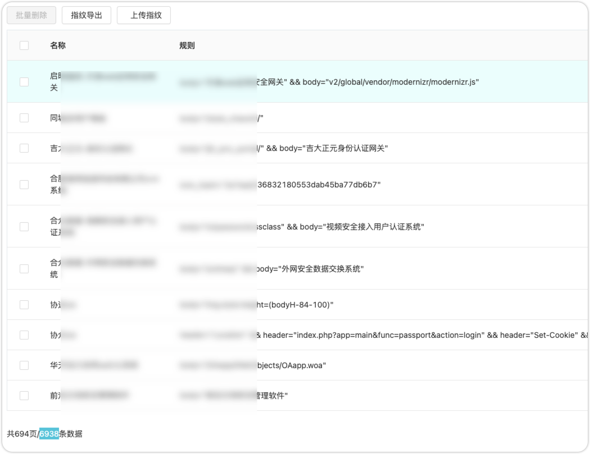

# ARL-Finger-ADD-Pro

## 主要功能

批量添加ARL指纹，支持：`ARL V2.6.1版本`，[ARL V2.6.1版本更新指纹检测规则](https://github.com/TophantTechnology/ARL/releases/tag/v2.6.1)。

如有需要使用ARL V2.6.1版本以前的指纹导入功能，请移步：[ARL-Finger-ADD-Plus](https://github.com/BigYoungs/ARL-Finger-ADD-Plus)

> 提示：ARL-Finger-ADD-Pro和ARL-Finger-ADD-Plus，两个工具不通用，请**谨慎选择使用**。

## 已支持导入的指纹库列表，共计：9001个

1. [Ehole3.1](https://github.com/EdgeSecurityTeam/EHole/releases/tag/v3.1)自带的指纹文件，Finger有1007个
2. [Finger](https://github.com/EASY233/Finger/blob/main/library/finger.json) 截止2023年3月11日最新版，Finger有1007个
3. [FingerprintHub](https://github.com/0x727/FingerprintHub/blob/main/web_fingerprint_v3.json) 截止2023年11月23日最新版，Finger有2839个
4. [dismap](https://github.com/zhzyker/dismap/blob/main/readme-zh.md#-rulelab) 截止2023年12月17日最新版，Finger有4598个

## 用法:

```
提示：本工具只适配此项目源码下的Finger指纹，网上下载的Finger指纹可能不适配，如需使用网上下载的Finger指纹，需要自行修改代码。

Usage: ARL_Finger_Add_Plus.py [options]

Options:
  -h, --help                  show this help message and exit
  -u URL, --url=URL           Please Enter the ARL Site Url
  -a AUTH, --auth=AUTH        Please Enter Your ARL username password
  -f FINGER, --finger=FINGER  Please Enter You Want import Finger, eg:
                              1：Ehole3.1_finger.json        2：Finger_finger.json
                              3：FingerprintHub_finger.json  4：Dismap_rule.go
                              all: 导入工具支持的所有指纹
  -t TOKEN, --token=TOKEN     Please Enter Your ARL Auth Token
  -d DELETE_F, --delete_f=DELETE_F
                              此参数用于删除ARL中已有的指纹，请谨慎使用此参数。删除前默认备份指纹到当前目录下的ARL_API_finger.yml文件


使用示例：

ARL API Key 用法：
python3 ARL_Finger_Add_Plus.py -u https://192.168.1.1:8888 -t 1234567890abcdefg -f all

ARL 用户名密码 用法：
python3 ARL_Finger_Add_Plus.py -u https://192.168.1.1:8888 -a admin:arlpass -f all

```

## 版本记录

### v1.0.0 2024-01-04

1. 此次ARL 2.6.1的更新，支持了多种指纹匹配的逻辑关系，所以此脚本的针对新的规则重新实现了规则适配，重写所有的指纹适配方法。
2. 增加`-d`参数，可以批量删除ARL系统里已有的所有指纹。同时会在项目根目录自动备份已有的指纹，便于保留备份。旧版本指纹规则，只有逻辑或，误报非常高。
3. 如果从2.6.0及以下版本升级到2.6.1的，建议重新导入此工具的指纹，多种逻辑匹配规则，提高了指纹的命中率。
4. ARL-Finger-ADD-Plus脚本当时限制于ARL的指纹规则，实际导入有效指纹只有4000+，此版本导入**有效指纹6900+**。

### V1.0.1 2024-01-09

1. 修复报错：`ARL Finger YML File 创建失败，报错信息：'gbk' codec can't encode character '\\xa0' in position 13: illegal multibyte sequence`

### V1.0.2 2024-03-20

1. 修复Bug: 删除所有指纹时，提示：“删除所有指纹失败！失败原因：{res['msg']} KeyError: 'msg'”
2. 修复Bug：删除所有指纹时，使用账号密码登录失败的问题
3. 优化：`-u` 参数的ARL地址必须是https，代码做了此处的兼容处理

## 常见问题

Q：导入指纹库时，返回报错信息：**413错误**

A：这是因为ARL的Nginx默认配置，未设置上传文件的大小限制。解决办法：需要先修改ARL的Nginx配置，具体修改方法如下：

```
# 以下内容针对ARL容器部署的情况，如果是源码部署的，同理

1. 进入到arl-web容器里，执行：docker exec -it arl-web /bin/bash

2. vim /etc/nginx/nginx.conf

3. 在http块下，添加以下内容：
    client_max_body_size 20m;

4. 重启nginx：nginx -s reload

5. 退出容器：exit

6. 重新运行脚本
```

Q：为什么指纹库列表说是9000+，导入后没有这么多？

A：因为使用的是ARL的指纹文件导入接口，此接口支持去重功能，如果使用单个指纹导入接口，没有去重功能，应该是9000+，但是那样没有意义。

其他问题，待补充~

## 添加后的效果

**ARL 2.6.1版本支持多种逻辑规则，导入后效果如下图所示**



## 版权声明

ARL-Finger-ADD-Pro本软件，通过BigYoung购买专栏后，有权进行个人使用，禁止公开发布和用于商业用途，否则BigYoung有权追究法律责任。

## 免责声明

ARL-Finger-ADD-Pro 仅供学习交流使用，禁止用于非法用途，否则后果自负。

## 下载地址&获取最新版

[https://afdian.net/a/bigyoung?tab=shop](https://afdian.net/a/bigyoung?tab=shop) 页面搜“ARL-Finger-ADD-Pro”
